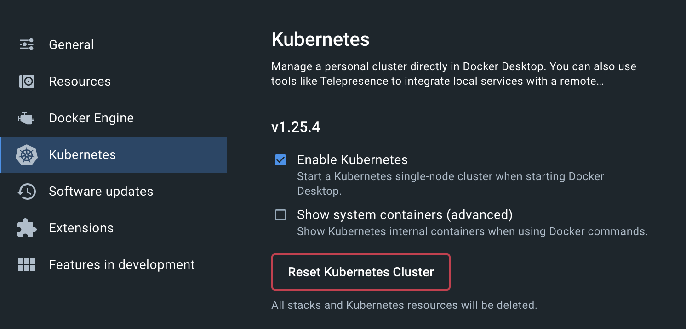
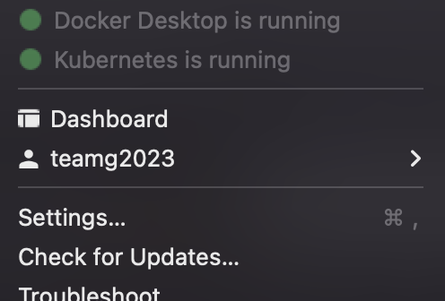

## Guide to Run and Test Application in Development Environment

[Video - Demo](https://www.youtube.com/watch?v=gfGXDlM2QeQ)

This guide is to be able to run the application in  a development environment, that is inside a local computer.

### Steps
1. Install [Docker Desktop](https://docs.docker.com/get-docker/)
2. Verify that `docker` was successfully installed and you are able to access it through the terminal.
```shell
docker --version
```
2. Login into docker with the following credentials either through the application or the CLI.
    * `username`: teamg2023
    * `password`: TeamG2023
```shell
docker login
```
3. Enable Kubernetes in Docker desktop.

4. Verify  `kubectl` was installed with Docker Desktop
```shell
kubectl version --short
```
5. You should see that Kubernetes is running when starting Docker Client. (Top right of your screen for MacOS)

6. Install Skaffold
[Skaffold Setup](https://skaffold.dev/docs/install/)


### Context Environment
1. Verify your `kubectl` context using the following command. Should default to `docker-desktop`
```shell
kubectl config current-context
```
2. Create JWT secret within the context
```shell
kubectl create secret generic jwt-secret --from-literal=JWT_KEY=volumetric-capture-523-jwt
```
3. Start and Ingress-Inginx Controller 
```shell
kubectl apply -f https://raw.githubusercontent.com/kubernetes/ingress-nginx/controller-v1.7.0/deploy/static/provider/cloud/deploy.yaml
```
4. Verify `ingress-nginx` was created
```shell
kubectl get pods --namespace=ingress-nginx
```
```shell
// Output
NAME                                        READY   STATUS      RESTARTS       AGE
ingress-nginx-admission-create-s87ql        0/1     Completed   0              5d19h
ingress-nginx-admission-patch-qphfl         0/1     Completed   1              5d19h
ingress-nginx-controller-7d9674b7cf-2nwgg   1/1     Running     8 (167m ago)   5d19h
```
5. Modify your `etc/host` file.
    * Add the following line to the file
    ```plaintext
    127.0.0.1 volumetric.dev
    ```

## Running the Application

1. In a separate terminal window run the following.
```
kubectl port-forward --namespace=ingress-nginx service/ingress-nginx-controller 8080:80
```
* This will redirect PORT 8080 in your local computer to the ingress-nginx load balancer.
2. Open a second terminal window and run the following command.
```shell
skaffold dev
```
* This command will run all deployments needed for the application, that is all services that are being used. If it is the first time installing them, it might take several minutes.

It is recommended to open the application in `Google Chrome` as it is being deployed in a development environment and does not have a valid SSL certificate. In case you are prompted a message of this page is unsafe. While having that same window open just type in your `thisisunsafe`.

After all deployments have initialized, you will be able to access the application at: [https://volumetric.dev](http://volumetric.dev)


